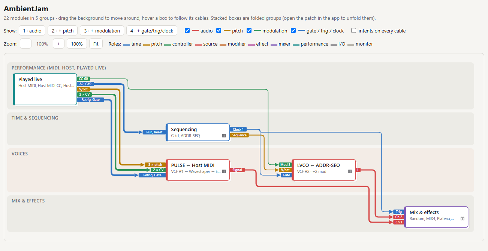
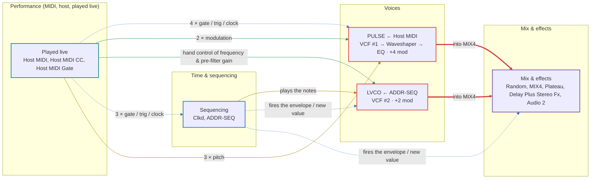
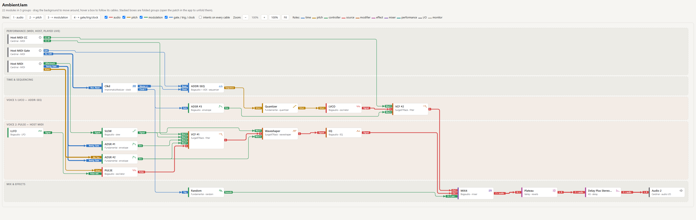
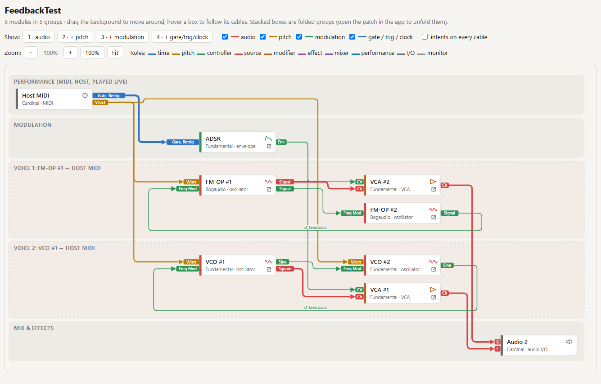
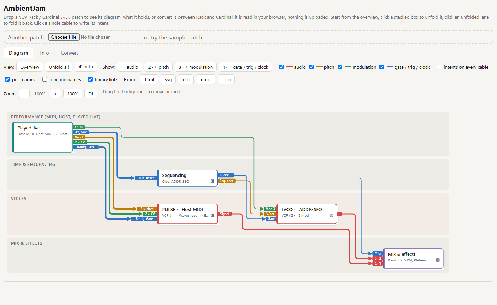
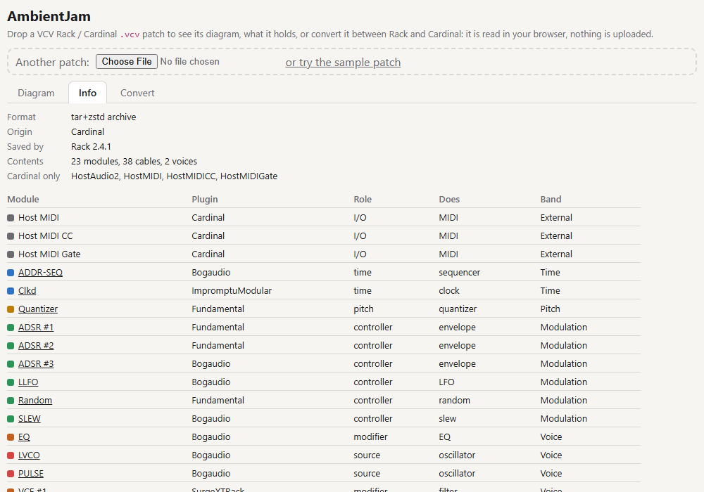

# VcvPatchTools

Tools for [VCV Rack](https://vcvrack.com/) / [Cardinal](https://github.com/DISTRHO/Cardinal) `.vcv` patches:

- **Diagram**: turns a patch into a **macro block diagram that explains it**: who does what, where the sound comes from, what modulates it, and why each cable is there.
- **Info**: what a patch file is and holds: Rack or Cardinal, format, every module with its role.
- **Convert**: a patch between standalone VCV Rack and Cardinal (the plugin version of Rack), so a patch built in one opens correctly in the other (see [Converting between Rack and Cardinal](#converting-between-rack-and-cardinal)).

A dense patch is a wall of cables, knobs and lights. This tool reads the patch file and draws it the way synth manuals and teachers do (Moog manuals, *Patch & Tweak*): blocks by role, signal flowing left to right, cables typed by what they carry. It doesn't show the inside of modules: it shows how they work **together**.

It comes as:

- a **web app** (Blazor WebAssembly, runs entirely in the browser: the patch is never uploaded);
- a **command-line tool** (`vcvpatch`) to inspect, convert or render a patch;
- exports to a **self-contained interactive HTML page**, **SVG**, **Graphviz** (`.dot`), **Mermaid** (`.mmd`) and **JSON**.

All of them share the same C# libraries, so they always read, convert and draw a patch the same way.

**Try it online: [neilbgr.github.io/VcvPatchTools](https://neilbgr.github.io/VcvPatchTools/)**. Drop a `.vcv` file on the page, or open the sample patch, then switch between the **Diagram**, **Info** and **Convert** tabs. The patch is read in your browser and never uploaded.

<picture>
  <source media="(prefers-color-scheme: dark)" srcset="docs/screenshots/overview-dark.png">
  
</picture>

*A 22-module patch, folded into its main blocks: who plays it, what sequences it, the two voices and the mix bus.*

## What the diagram shows

Here is the folded overview of a small ambient patch, exported to Mermaid (GitHub renders it):



The HTML page and the web app draw the same thing with more detail: orthogonal "metro map" lines, layers you switch on one by one, and boxes you unfold.

### Bands (rows), by role

From top to bottom:

| Band | Contains |
|---|---|
| Performance | what the musician plays: Host MIDI, MIDI-to-CV, on-screen pads and joysticks played with the mouse, keyboard zones and pads fed by MIDI. A pad or joystick driven by another module of the patch (a sequencer, an LFO) moves to the band of what it then does |
| Time & sequencing | clocks, sequencers, gate/trigger logic |
| Pitch | quantizers, pitch processing |
| Modulation | LFOs, envelopes, random, slew… shared by several voices |
| Voices | one lane per voice: a sound source and what shapes it before the mixer |
| Mix & effects | mixers, bus effects, audio out |

### Columns, by signal path

Each box is placed by the longest signal path that leads to it, so the patch reads **left to right**, from control to sound.

### Boxes and ports

Inspired by the diagrams of the YouTube channel *MonoTrail Tech Talk*:

- **Port tabs**: where a cable plugs into a box, a small tab in the cable's color names the port (`V/oct`, `Gate`, `Cutoff`, `CC 74`, `A2`…). You see what a cable acts on without reading anything along it. Long names are shortened; hover a tab for the full name. Off with "port names" (web app) or `--no-ports` (CLI).
- **Trunks**: cables leaving the same output share one exit, one line and their first turn, then branch towards their targets, like a mult.
- **Function icons**: each module box shows what it does with a small drawing (waveform for an oscillator, cutoff slope for a filter, ADSR outline for an envelope…), and its function in the subtitle. With "function names" (web app) or `--functions` (CLI), the function becomes the title (`FILTER #1`, `ENVELOPE #2`) and the module name goes under it.
- **VCV Library links**: a small ↗ icon on each module box opens its page on [library.vcvrack.com](https://library.vcvrack.com), to find the module in Rack or Cardinal. Hovering the icon shows the module's panel. The screenshot is fetched only then, kept for the rest of the session and cached by the browser; a module the Library doesn't have is remembered and never asked for again. Cardinal-only modules get no icon. A folded group has a panels icon instead (no link): hovering it shows each of its modules once, with a `×3` badge when there are several, up to 12 panels. Off with "library links" (web app) or `--no-links` (CLI).
- **Legend**: an exported `.svg` carries its own legend (the signals and roles it shows), so it reads on its own once shared.

### Cables, by signal type

The type comes from the patch's own cable colors, cross-checked with the real port names:

| Signal | Line | Cable color in the patch |
|---|---|---|
| Audio | thick, red | `#ff5252` |
| Pitch (1V/oct) | medium, amber | `#ffd452` |
| Modulation (CV) | thin, green | `#52ff7d`, `#a8ff52` |
| Gate / trig / clock | thin, blue | `#52beff` |

When a color contradicts the port (a red cable from an LFO into a cutoff CV input), the port wins and a diagnostic says so.

### Layers, a teaching path

The toolbar shows the patch step by step: **1 · audio** (where the sound goes), **2 · + pitch** (who plays the notes), **3 · + modulation** (what makes it move), **4 · + gate/trig/clock** (what triggers it). Each layer can also be toggled on its own.

### Folded overview first, details on demand

A complex patch gives a complex diagram, which defeats the purpose. So the first view is **folded**:

- each **voice** is one box (`PULSE ← Host MIDI`, with its chain `VCF #1 → Waveshaper → EQ · +4 mod`); identical voices merge (`LVCO ×3`);
- a modulator whose cables all go to one voice is folded into that voice;
- shared modulators, time, performance and the mix bus are one box each.

Click a box (web app) to unfold it into its modules, in a lane of its own. The CLI does the same with `--unfold`.

<picture>
  <source media="(prefers-color-scheme: dark)" srcset="docs/screenshots/unfolded-dark.png">
  
</picture>

*The same patch, everything unfolded: one lane per voice, signal flowing left to right.*

### What the analysis recognizes

- **Voices**: a source (oscillator, complete voice such as Lunar VCO) and everything that processes its audio before a mixer.
- **Voice processing vs bus processing**: a filter right after an oscillator belongs to that voice; a filter after the mixer is on the bus.
- **Inserts and send/returns**: an effect patched into a module's insert or aux send and returning into it is drawn stacked under its host, with a side loop.
- **Expanders**: an expander docked to its base (Venom mix expanders, MindMeld AuxSpander…) is part of it. Its cables attach to the base, ports prefixed with its name (`Mix Pan › Pan CV 2`).
- **Feedback loops**: cross-modulation and feedback are drawn turning back to their target, tagged `↺ feedback`, and hinted on folded boxes.

<picture>
  <source media="(prefers-color-scheme: dark)" srcset="docs/screenshots/feedback-dark.png">
  
</picture>

- **Surge XT modulation**: Surge XT modules have "Modulation Signal n" inputs that can be assigned to any knob. The tool reads which knob each input moves and by how much (`Mod 1 → Cutoff +35%`), or reports when an input moves nothing.
- **MIDI learn**: the cells of MIDI gate and CC modules (Rack's MIDI to Gate / MIDI CC to CV and their CV to MIDI counterparts, Cardinal's Host MIDI Gate / CC) are named by the note or controller they learned in the patch: `Gate 13 · A2`, `Cell 2 · CC 74 (cutoff)`.
- **Scopes and displays** never get a box (they explain nothing about the sound). With "scopes & displays" on, they show as a 👁 badge on the box they watch.
- **Contextual roles**: controls played live (on-screen pads, joysticks, keyboard zones) belong to performance when played with the mouse or fed by Host MIDI, but become pitch/time/control utilities when another module of the patch drives them; a "visual" module with outputs is a controller.

### Intents

Every cable gets an **intent**, a short sentence for why it's there ("plays the notes", "the LFO moves the cutoff"). It is pre-filled from the ports and roles. In the web app, click a cable to write your own: intents are kept in your browser and included in exports.

### Diagnostics

`inspect` and the web app list what looks suspicious:

- stacked cables on one input (summed by Rack ≥ 2.5, but Cardinal keeps only the first one);
- cable colors that contradict the port;
- modules whose role was guessed (to add to `catalog/roles.json`);
- modules missing from the port catalog;
- Surge XT modulation inputs with no target.

## Layout algorithm

The drawing follows the **Sugiyama framework** for layered graphs (Sugiyama, Tagawa & Toda, 1981), the method behind Graphviz `dot` and ELK Layered, adapted to role bands:

1. **Cycle breaking**: feedback loops are broken with the greedy heuristic of Eades, Lin & Smyth (1993), so that as few cables as possible go backwards.
2. **Layering**: columns by longest path.
3. **Virtual nodes**: a cable spanning several columns gets a thin track in each column it passes, like a metro line, so it never runs through a box. A feedback cable gets tracks from its source's column back to its target's.
4. **Crossing reduction**: barycenter heuristic, alternating sweeps, keeping the order with the fewest crossings.
5. **Orthogonal routing**: every bend happens in the gap between columns, each cable in its own channel. Busy gaps widen, and boxes grow with their number of connections so arrowheads never overlap.

Strongly connected components (Tarjan, 1972) find the feedback loops reported by the analysis.

## Converting between Rack and Cardinal

Cardinal runs as a plugin inside a DAW, so it can't talk to real MIDI/audio devices the way standalone Rack does. It replaces Rack's hardware-facing "Core" modules with its own DAW-facing equivalents:

| Rack (Core) | Cardinal |
|---|---|
| `MIDI-CV` **+** `CV-MIDI` | `Host MIDI` (one module) |
| `MIDI-CC-CV` **+** `CV-MIDI CC` | `Host MIDI CC` (one module) |
| `MIDI-Gate` **+** `Gate-MIDI` | `Host MIDI Gate` (one module) |
| `Audio-2` / `Audio-8` | `Host Audio 2` / `Host Audio 8` |
| `MIDI-Map` | `Host MIDI Map` |

If you open a Cardinal-saved patch in standalone Rack (or vice versa), those modules are simply missing — the patch loads broken, with dangling cables. `vcvpatch convert` (or the web app's **Convert** tab) rewrites the patch so the right modules, cables, and settings (MIDI channel, learned CC numbers, learned gate notes...) come out the other side.

```bash
# Cardinal -> Rack: writes "My Patch.rack.vcv" next to the original (the direction is guessed from the patch)
vcvpatch convert "My Patch.vcv"

# An explicit output name, or an explicit direction (for a patch with no Cardinal- or Rack-only module)
vcvpatch convert "My Patch.vcv" "My Patch for the studio.vcv"
vcvpatch convert plain-patch.vcv --to cardinal

# A whole folder
for f in ~/Documents/VCVRack/*.vcv; do vcvpatch convert "$f" --to rack; done
```

Re-running a conversion won't overwrite a previous result: it adds `.x1`, `.x2`, etc. (`--force` overwrites). In the web app, the **Convert** tab does the same and downloads the converted patch, or opens it in the app.

`convert` prints a `Warnings` section whenever something couldn't be carried over 1:1 (see the mapping details below for exactly which cases these are). No warnings means the conversion is complete — every module and cable maps cleanly.

### What happens during a conversion

**Cable colors are translated to the other app's palette.** Rack's default cable palette (5 colors) and Cardinal's (16 colors) don't share any hex values, so left alone a cable's color would come out as an arbitrary, unrelated hue on the other side. Every cable's color — including a manually-picked custom color, not just the app's own default palette — is remapped to whichever color in the destination palette has the closest hue, so a red cable stays red, a green one stays green, etc. Pass `--no-cable-colors` (or untick "map cable colors" in the web app) to skip this and leave colors exactly as they are in the source file.

**Straight renames** — same module, same ports, just a different plugin/name: `AudioInterface2`↔`HostAudio2`, `AudioInterface`↔`HostAudio8`, `MIDI-Map`↔`HostMIDIMap`, `Notes`↔`TextEditor`, `Blank`↔`Blank`.

**MIDI I/O modules are split or merged.** Cardinal's `Host MIDI` / `Host MIDI CC` / `Host MIDI Gate` each do both directions (MIDI-in **and** MIDI-out) in one panel; Rack splits each into two separate Core modules. Converting rewires every cable to the right half automatically:

| Cardinal | Rack "in" (MIDI → CV) | Rack "out" (CV → MIDI) |
|---|---|---|
| Host MIDI (9 HP) | MIDI-CV (8 HP) | CV-MIDI (8 HP) |
| Host MIDI CC (14 HP) | MIDI-CC-CV (10 HP) | CV-MIDI CC (10 HP) |
| Host MIDI Gate (14 HP) | MIDI-Gate (10 HP) | Gate-MIDI (10 HP) |

A few things worth knowing about this split:

- **Only the half you actually use gets created.** If nothing is patched into (or out of) one direction, that Rack module is skipped entirely rather than left dangling in the rack — e.g. a `Host MIDI` used only to receive notes produces just `MIDI-CV`, not an unused `CV-MIDI` next to it.
- **Everything downstream shifts to make room, or to close the gap.** The two Rack modules are always wider than the one Cardinal module they replace (e.g. Host MIDI CC's 14 HP becomes 20 HP as two 10 HP modules) — or narrower, when only one half survives (see above). Every other module further right on the same row is moved by exactly that amount, so nothing ends up overlapping and nothing that used to sit flush against something (an expander, for instance) ends up with a gap.
- **The MIDI channel comes along.** Cardinal shows channel 0 as "All" and channels 1-16 otherwise; Rack shows -1 as "All" and 0-15 otherwise. The conversion translates between the two, in both directions.
- **Learned CC numbers and learned gate notes come along too** — whatever you assigned on the Cardinal panel (or vice versa) shows up already filled in on the other side, instead of every cell reading "Learn" again.
- **Host MIDI Gate has 18 note cells; Rack's MIDI-Gate/Gate-MIDI only have 16.** Whichever cells you actually have cabled are compacted down into Rack's 16 slots (in their original order) rather than the two highest-numbered cells being silently discarded just because of their index — you only lose cells if you're genuinely using more than 16 at once, and that's reported as a warning naming the exact cell.
- **Rack → Cardinal merges rely on the two halves being adjacent** (i.e. drawn touching each other, the same relationship VCV expanders use). If a matching pair is found next to each other, they merge into one Cardinal module; a `MIDI-CV` (or `MIDI-CC-CV`/`MIDI-Gate`) with no adjacent partner still converts, but its MIDI-out inputs are left unconnected (reported as a warning).

**Host MIDI CC's 2 extra ports** (Channel Pressure, Pitchbend — Cardinal-only, beyond the 16 regular CC cells) have no Rack equivalent; any cable on them is dropped, and reported.

**Modules with no equivalent at all** in the other application are copied through unchanged, with a warning — they simply won't load there:
- Rack-only: `AudioInterface16`
- Cardinal-only: `HostCV`, `HostParameters`, `HostParametersMap`, `HostTime`, `CardinalBlank`, `AudioToCVPitch`, `Carla`, `Ildaeil`, `AidaX`, `AudioFile`, `GlBars`, `SassyScope`, `MPV`, `ExpanderInputMIDI`, `ExpanderOutputMIDI`

**What it can't do:** pick a MIDI device for you. Cardinal receives MIDI directly from its host DAW, with no device selection at all, so there's nothing to carry over — after converting to Rack you'll need to open the new `MIDI-CV`/`MIDI-CC-CV`/`MIDI-Gate` modules and choose a MIDI input device by hand (the channel, however, is already set correctly).

## Getting started

Requirements: the [.NET 10 SDK](https://dotnet.microsoft.com/download).

```bash
git clone https://github.com/neilbgr/VcvPatchTools.git
cd VcvPatchTools
make build
make test
```

### Web app

```bash
make web
```

Open http://localhost:5016 and drop a `.vcv` file (or add `?sample=AmbientJam` to the URL for the bundled sample, and `&tab=info` or `&tab=convert` to open that tab). In the **Diagram** tab:

- unfold/fold boxes, or use **Overview** / **Unfold all**;
- step through the layers, toggle "scopes & displays" (offered when the patch has some);
- switch port names on the box edges and function names in the titles;
- drag the background to pan, Ctrl + wheel to zoom;
- hover a box to follow its cables, click a cable to edit its intent;
- export `.html`, `.svg`, `.dot`, `.mmd` or `.json`.

On a phone or tablet (portrait or landscape), the diagram fills the screen and opens fitted to its width; the options fold under **Options**. Drag with a finger anywhere to pan and pinch to zoom. Tap a module box for its ports, details and VCV Library link; tap a library icon once to see the panel, twice to open the page. The theme button switches between the system theme, light and dark. The exported `.html` page pans, pinches and previews panels the same way.

<picture>
  <source media="(prefers-color-scheme: dark)" srcset="docs/screenshots/web-app-dark.png">
  
</picture>

The **Info** tab tells what the patch is (format, Rack or Cardinal, the Rack version that saved it) and lists every module with its plugin, role and function, linked to its VCV Library page. The **Convert** tab converts it to the other application and downloads the result, or opens it in the app.

<picture>
  <source media="(prefers-color-scheme: dark)" srcset="docs/screenshots/info-dark.png">
  
</picture>

`make publish-web` builds a static site in `publish/web/wwwroot`, which any static file server can host (no backend needed).

### Command line

```bash
dotnet run --project src/VcvPatchTools.Cli -- <command>
# or build a single-file executable: make publish-linux / make publish-win (output in publish/<runtime>/vcvpatch)
```

| Command | Does |
|---|---|
| `vcvpatch info <patch.vcv>` | Format, Rack or Cardinal origin, then modules by band, voices and their chains, inserts, groups, typed cables, loops, diagnostics |
| `vcvpatch convert <in.vcv> [out.vcv] [--to cardinal\|rack] [--force] [--no-cable-colors]` | Convert between Rack and Cardinal (see [above](#converting-between-rack-and-cardinal)) |
| `vcvpatch diagram <patch.vcv> [-o out.html]` | Self-contained interactive HTML page (folded overview) |
| `vcvpatch diagram <patch.vcv> -f svg\|dot\|mmd\|json [-o file]` | Other formats |
| `… --unfold all` or `--unfold voice-1,bus` | Unfold everything, or the given groups (keys listed by `info`) |
| `… --scopes` | Show scopes and displays as badges |
| `… --functions` | Title boxes by function (`FILTER #1`) |
| `… --no-ports` | No port tabs on the box edges |
| `… --no-links` | No VCV Library links on the module boxes |
| `vcvpatch catalog build --src <Cardinal/plugins>` | Regenerate the port catalog (see below) |

Windows paths are accepted under WSL (`"C:\Users\me\Documents\patch.vcv"` is read from `/mnt/c/...`). Patch files are only read, never modified: a conversion writes a new file. `inspect` and `render`, the commands' former names, still work.

Graphviz: `dot -Tsvg patch.dot > patch.svg`. Mermaid: paste the `.mmd` into any Markdown that supports it (GitHub, GitLab, Obsidian…) or https://mermaid.live.

## Port catalog and roles

`.vcv` files store cables as module id + port index. Names and roles come from three files in `catalog/`, embedded in the library:

| File | Content | Maintained |
|---|---|---|
| `ports.json` | port names of ~1,700 modules | generated by `make catalog` |
| `ports.overrides.json` | names the scanner can't work out | by hand, wins over `ports.json` |
| `roles.json` | role of a module (source, modifier, mixer…) | by hand, wins over plugin tags |

`make catalog PLUGINS=<path to Cardinal/plugins>` scans the C++ sources of every plugin bundled with Cardinal, plus Rack's own Core plugin (`src/Rack/Core.json` and `src/Rack/src/core` next to it):

- `createModel<…>("slug")`;
- `enum InputIds/OutputIds`, including `ENUMS(X, n)` with constant expressions and template arguments;
- `configInput` / `configOutput` names, including names built in loops;
- for Surge XT, `ModulationAssistant<…>` (which knob each modulation input can move).

What it can't resolve is listed in `catalog/scan-report.txt`. Without a role in `roles.json`, a module's role is guessed from its `plugin.json` tags and its name, and reported as guessed.

## Project layout

```
src/VcvPatchTools.Core/      reading and writing .vcv files, module knowledge; no file I/O (runs in the browser)
  Patch/      .vcv archives (zstd + tar, without System.Formats.Tar, unsupported in WebAssembly), patch model
  Catalog/    port catalog, source scanner, roles, functions, VCV Library links
src/VcvPatchTools.Diagram/   the diagram, no file I/O
  Analysis/   signal typing, voices, inserts, expanders, loops, grouping, intents
  Layout/     layered layout (positions and cable paths: the single source of truth for every renderer)
  Render/     SVG, HTML, Graphviz, Mermaid; shared CSS and JavaScript
src/VcvPatchTools.Bridge/    Rack <-> Cardinal conversion (module mapping, cable colors), no file I/O
src/VcvPatchTools.Cli/       vcvpatch command-line tool (the only project touching files)
src/VcvPatchTools.Web/       Blazor WebAssembly app
tests/VcvPatchTools.Tests/   xUnit tests (Core/, Diagram/, Bridge/, Cli/); tests/fixtures: sample patches; tests/golden: golden files
catalog/                     port catalog and roles
```

## Development

- Tests: `make test`. Exporter output is pinned by golden files in `tests/golden`: after an intended change, regenerate them with `UPDATE_GOLDEN=1 dotnet test` and review the diff. The conversion tests (`tests/VcvPatchTools.Tests/Bridge`) are the source of truth for the exact mapping rules.
- History: the converter was developed as VcvPatchBridge, a separate repository, and merged here with its history.
- Style: `make format` (`dotnet format`, rules in `.editorconfig`; explicit types, no `var`).
- Screenshots (`docs/screenshots`, light and dark): rendered pages captured with a headless browser, e.g. `msedge --headless=new --blink-settings=preferredColorScheme=1 --window-size=W,H --screenshot=out.png page.html` (`=0` for dark).
- Web app online: every push to `main` runs the tests and publishes it to GitHub Pages (`.github/workflows/pages.yml`).
- Contributions welcome, especially entries for `catalog/roles.json` and `catalog/ports.overrides.json` for the modules you use.

## AI disclosure

This project was written with an AI coding assistant: almost all of its code, tests and documentation
were generated by [Claude Code](https://claude.com/claude-code) (Anthropic's Claude models).
I'm a C#/.NET developer: I designed the features, chose the architecture, reviewed the code
and tested the results on my own patches, but I did not write most of it by hand.

Commits produced this way carry a `Co-Authored-By: Claude` trailer.

This is stated for information only, for instance if you are collecting code to train AI models
and prefer to leave out AI-generated code.

## License

[MIT](LICENSE)
